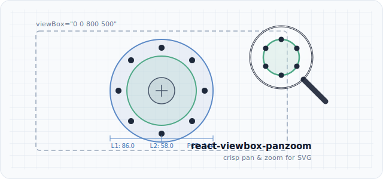

<div align="center">

# react-viewbox-panzoom

**Headless, dependency-free pan & zoom for SVG — driven by the `viewBox` attribute.**

Cursor-anchored wheel zoom · drag pan · two-finger pinch · programmatic control — plus a bonus 1-D label de-overlap solver. Stays pixel-crisp at any zoom.

[](https://www.npmjs.com/package/react-viewbox-panzoom)
[](https://github.com/therealsunson/react-viewbox-panzoom/actions/workflows/ci.yml)
[](https://bundlephobia.com/package/react-viewbox-panzoom)
[](https://www.npmjs.com/package/react-viewbox-panzoom)
[](./LICENSE)

[**Live demo →**](https://therealsunson.github.io/react-viewbox-panzoom/)



</div>

---

## Why

Most React pan/zoom libraries wrap the content in a `<div>` and animate a CSS `transform: scale()`. That blurs raster content, distorts stroke widths, breaks crisp hairlines, and throws off hit-testing.

For **vector** content — technical diagrams, dimensioned drawings, schematics, charts, maps — the right primitive is the SVG **`viewBox`**. Pan and zoom by changing the visible window, and the browser re-rasterizes vectors at full resolution every frame: hairlines stay 1px, text stays sharp, coordinates stay coordinates.

`react-viewbox-panzoom` does exactly that, and nothing else. It owns no DOM, ships no styles, and has **zero runtime dependencies** (React is a peer dependency). You render the `<svg>`; the hook hands you a `viewBox` string and the gesture handlers.

## Features

- 🎯 **viewBox-native** — vectors stay crisp; stroke widths and text scale exactly per spec.
- 🖱️ **Cursor-anchored wheel zoom** — the point under the pointer stays put as you zoom.
- ✋ **Drag to pan**, 👆 **one-finger pan**, and 🤏 **two-finger pinch** out of the box.
- 🧩 **Headless** — a hook (`usePanZoomViewBox`) with an optional thin component (`PanZoomSvg`). Style it however you like.
- 🪶 **Tiny & dependency-free** — React peer only. Tree-shakeable; importing just the label solver pulls in no React code.
- 🧮 **Bonus: `resolveLabelOverlap`** — a pure 1-D label declutter solver for axes, rulers, and timelines.
- 🟦 **First-class TypeScript** — full types, dual ESM/CJS builds.

## Install

```bash
npm install react-viewbox-panzoom
# or: pnpm add / yarn add / bun add
```

## Quick start

### The hook

```tsx
import { usePanZoomViewBox } from 'react-viewbox-panzoom'

function Diagram() {
  const pz = usePanZoomViewBox({ initial: { x: 0, y: 0, width: 800, height: 500 } })

  return (
    <div
      ref={pz.containerRef}
      style={{ position: 'relative', height: 400, cursor: 'grab', touchAction: 'none' }}
    >
      <svg viewBox={pz.viewBoxString} style={{ width: '100%', height: '100%' }}>
        <rect x={120} y={120} width={560} height={260} rx={12} fill="#5b89c6" />
        <circle cx={400} cy={250} r={70} fill="#4fa987" />
      </svg>

      <div style={{ position: 'absolute', top: 8, right: 8, display: 'flex', gap: 4 }}>
        <button onClick={() => pz.zoomBy(1.2)}>＋</button>
        <button onClick={() => pz.zoomBy(0.8)}>－</button>
        <button onClick={pz.reset}>Reset</button>
      </div>
    </div>
  )
}
```

> **Tip:** set `touch-action: none` on the container so the browser doesn't hijack pinch/pan as page scroll/zoom.

### The component (batteries included)

```tsx
import { PanZoomSvg } from 'react-viewbox-panzoom'

;<PanZoomSvg
  viewBox={{ x: 0, y: 0, width: 800, height: 500 }}
  style={{ height: 400, border: '1px solid #e2e8f0', borderRadius: 12 }}
  controls={(pz) => (
    <div style={{ position: 'absolute', top: 8, right: 8 }}>
      <button onClick={() => pz.zoomBy(1.2)}>＋</button>
      <button onClick={() => pz.zoomBy(0.8)}>－</button>
      <button onClick={pz.reset}>Reset</button>
    </div>
  )}
>
  <rect x={120} y={120} width={560} height={260} rx={12} fill="#5b89c6" />
</PanZoomSvg>
```

## How it works

Two design choices do the heavy lifting:

**1. The `viewBox` is the source of truth.** State holds `{ x, y, width, height }`; you bind it to the SVG's `viewBox`. Zooming shrinks the window (smaller `width`/`height`); panning slides it (`x`/`y`). Because React owns the attribute, there's no imperative `setAttribute` racing the reconciler.

**2. Gesture listeners bind once and read live state from a ref.** Wheel and touch listeners are attached with `addEventListener(..., { passive: false })` so they can `preventDefault()` the page's native scroll/zoom — something React's synthetic `onWheel` can't reliably do. The naive approach re-binds those listeners on every `viewBox` change, which drops fast wheel and pinch deltas in the remove/re-add gap. Instead, the listeners are bound **once** and read the current `viewBox` from a ref mirror, so they always see fresh state without churn:

```
state (for render) ──┐
                     ├──► single commit() updates both
ref mirror (for the ─┘     so the once-bound listeners stay correct
event listeners)
```

Cursor-anchored zoom keeps the point under the pointer fixed by solving for the new window origin so that point maps to the same screen position before and after the scale.

## API

### `usePanZoomViewBox(options)`

| Option      | Type                       | Default | Description                                                  |
| ----------- | -------------------------- | ------- | ------------------------------------------------------------ |
| `initial`   | `ViewBox`                  | —       | **Required.** The base ("100%") frame, restored by `reset()`. |
| `minZoom`   | `number`                   | `0.25`  | Smallest zoom multiplier relative to `initial`.              |
| `maxZoom`   | `number`                   | `8`     | Largest zoom multiplier.                                     |
| `wheelStep` | `number`                   | `1.15`  | Multiplier applied per wheel notch.                          |
| `wheel`     | `boolean`                  | `true`  | Enable cursor-anchored wheel zoom.                           |
| `pan`       | `boolean`                  | `true`  | Enable mouse drag + one-finger touch pan.                    |
| `pinch`     | `boolean`                  | `true`  | Enable two-finger pinch zoom.                                |
| `onChange`  | `(vb: ViewBox) => void`    | —       | Fires on every viewBox change.                               |

**Returns** `PanZoomViewBox`:

| Field            | Type                          | Description                                            |
| ---------------- | ----------------------------- | ------------------------------------------------------ |
| `containerRef`   | `RefObject<HTMLDivElement>`   | Attach to the element wrapping your `<svg>`.           |
| `viewBox`        | `ViewBox`                     | The current viewBox object.                            |
| `viewBoxString`  | `string`                      | Ready for the SVG `viewBox` attribute.                 |
| `zoom`           | `number`                      | Current multiplier (`1` = `initial`).                  |
| `zoomBy(factor)` | `(number) => void`            | Zoom about the center (`>1` in, `<1` out).             |
| `setZoom(z)`     | `(number) => void`            | Absolute zoom about the center.                        |
| `reset()`        | `() => void`                  | Restore `initial`.                                     |
| `setViewBox(vb)` | `(ViewBox) => void`           | Imperatively set the window (e.g. fit-to-region).      |

### `<PanZoomSvg>`

All hook options except `initial` (passed as the `viewBox` prop), plus: `children`, `className`, `style`, `svgProps`, and `controls(api) => ReactNode`. Forwards a `ref` exposing the `PanZoomViewBox` API.

### `resolveLabelOverlap(items, options?)`

Spread overlapping labels along one axis so none collide, moving each as little as possible.

```ts
import { resolveLabelOverlap } from 'react-viewbox-panzoom'

const resolved = resolveLabelOverlap(
  [
    { center: 100, size: 40 },
    { center: 110, size: 40 },
    { center: 125, size: 40 },
  ],
  { gap: 6 },
)
resolved.forEach((r) => drawLabelAt(r.center)) // r.shift tells you how far it moved
```

Items accept an optional `weight` (higher = more anchored, moves less). Pure and deterministic; inputs are never mutated.

## Recipes

**Fit to a region** — zoom to a bounding box with a margin:

```ts
const pad = 0.1
pz.setViewBox({
  x: bbox.x - bbox.width * pad,
  y: bbox.y - bbox.height * pad,
  width: bbox.width * (1 + 2 * pad),
  height: bbox.height * (1 + 2 * pad),
})
```

**Declutter ruler labels** — feed label centers/widths through the solver before drawing leader lines back to each true tick.

## Notes

- **Touch:** add `touch-action: none` to the container (the `PanZoomSvg` component does this for you).
- **SSR:** safe — listeners attach in `useEffect`, so nothing touches the DOM during render.
- **React 17 – 19** supported (peer dependency `react >= 17`).

## Development

```bash
npm install
npm run typecheck   # tsc --noEmit
npm test            # vitest
npm run build       # tsup → dist (ESM + CJS + d.ts)
npm run demo:dev    # run the examples/demo app
```

## License

[MIT](./LICENSE) © Sunny Rangsiman
